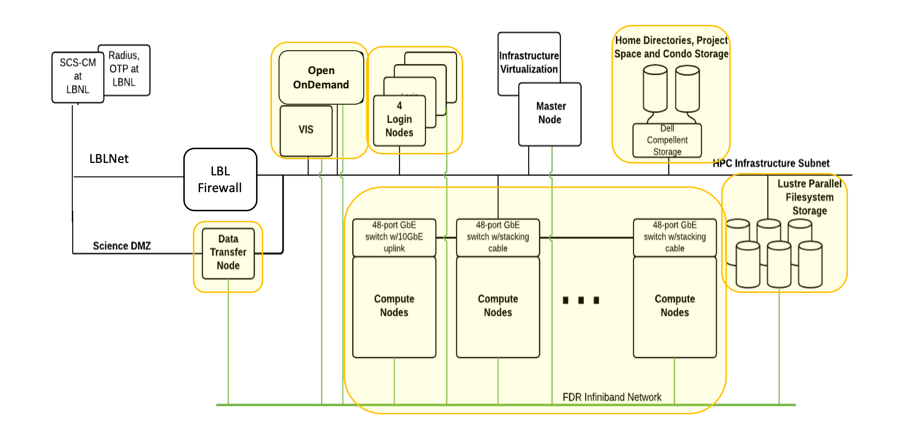

% Slurm training: How job scheduling works
% September 20, 2021
% Wei Feinstein


# Outline

This training session will cover the following topics:

- Submitting Jobs 
    - Serial jobs
    - Parallel jobs
    - Other kinds of jobs
    - Checking on running jobs
    - Possible submission errors
- How Slurm Works 
    - Introduction to queueing on clusters
    - Slurm details
    - How Slurm is set up on Lawrencium
- Common Queue Questions
    - Why isn't my job running (yet)?
    - Making jobs run sooner
     

# The Lawrencium cluster

<center></center>


# Slurm's job

All computations are done by submitting jobs to the scheduling software that manages jobs on the cluster, called Slurm.

Lawrencium uses Slurm to:

 1) Allocate access to resources (compute nodes) for users' jobs
 2) Start and monitor jobs on allocated resources
 3) Manage the queue of pending jobs

Why is this necessary? Otherwise your jobs would be slowed down by other people's jobs running on the same node. This also allows everyone to fairly share Lawrencium


# Submitting jobs: accounts and partitions


You can see what accounts you have access to and which partitions within those accounts as follows:

```
sacctmgr show associations -p user=$USER
```

Here's an example of a user who has access to a condo, a PCA and a special departmental account:
```
[wfeinstein@perceus-00 ~]$ sacctmgr show assoc -p user=jfroula
Cluster|Account|User|Partition|Share|Priority|GrpJobs|GrpTRES|GrpSubmit|GrpWall|GrpTRESMins|MaxJobs|MaxTRES|MaxTRESPerNode|MaxSubmit|MaxWall|MaxTRESMins|QOS|Def QOS|GrpTRESRunMins|
perceus-00|jgicloud|jfroula|ood_inter|1|||||||||||||lr_interactive|||
perceus-00|jgicloud|jfroula|jgi|1|||||||||||||normal|||
perceus-00|lr_jgicloud|jfroula|lr3|1|||||||||||||condo_jgicloud|||
perceus-00|pc_jaws|jfroula|ood_inter|1|||||||||||||lr_interactive|||
perceus-00|pc_jaws|jfroula|cm1|1|||||||||||||cm1_debug,cm1_normal|||
perceus-00|pc_jaws|jfroula|cf1|1|||||||||||||cf_debug,cf_normal|||
perceus-00|pc_jaws|jfroula|es1|1|||||||||||||es_debug,es_normal|||
perceus-00|pc_jaws|jfroula|lr_bigmem|1|||||||||||||lr_debug,lr_normal|||
perceus-00|pc_jaws|jfroula|lr6|1|||||||||||||lr_debug,lr_normal|||
perceus-00|pc_jaws|jfroula|lr5|1|||||||||||||lr_debug,lr_normal|||
perceus-00|pc_jaws|jfroula|lr4|1|||||||||||||lr_debug,lr_normal|||
perceus-00|pc_jaws|jfroula|lr3|1|||||||||||||lr_debug,lr_normal|||
perceus-00|pc_jaws|jfroula|lr2|1||||||||||0|||lr_debug,lr_normal|||
```

- Condo account lr_jgicloud, access to partition=lr3 with QoS=condo_jgicloud
- PCA account pc_jaws, access to all the Lawrencium partitions, including ES1 (gpu) with QoS=lr_normal/lr_debug.
- Departmental account jgicloud, access to the standalone cluster jgi with QoS=normal

# Submitting a batch serial job

Let's see how to submit a simple job. If your job will only use the resources on a single node, you can do the following. 

Here's an example job script that I'll run. You'll need to modify the `--account` value and possibly the `--partition` value.

```bash
#!/bin/bash
# Job name:
#SBATCH --job-name=serial-job
#
# Account:
#SBATCH --account=co_jgicloud
#
# Partition:
#SBATCH --partition=lr3
#
# QoS
#SBATCH --qos=condo_jgicloud
#
# Wall clock limit (one here):
#SBATCH --time=1:00:00
#
# Node#
#SBATCH --node=1
#
#SBATCH -o %j.out # Standard output
#SBATCH -e %j.err # Standard error

## Command(s) to run:
module load python/3.6
python calc.py >& calc.out
```

# Submitting a batch serial jobs in parallel 

- GNU Parallel is a shell tool for executing jobs in parallel on one or multiple computers. 
- A job can be a single core serial task, multi-core or MPI application, or command that reads from a pipe. 
- The typical input 
  - A bash file to run a serial task and a task list
  - A list of parameters required for each task
  - A SLURM job submission script where GNU parallel launches parallel tasks

# Submitting a batch serial jobs in parallel
#### Serial bash and tasks
```bash
#!/bin/bash
module load  bio/blast/2.6.0
blastp -query $1 -db ../blast/db/img_v400_PROT.00 -out $2  -outfmt 7 -max_target_seqs 10 \
-num_threads $3
```
where $1, $2 and $3 are the three parameters required for each serial task
 
#### Task list 
A list of task parameters in the format of one line per task. 
```
[user@n0002 BRC] cat task.lst    
 ../blast/data/protein1.faa
 ../blast/data/protein2.faa
...
 ../blast/data/protein100.faa
 
```

# Submitting a batch serial jobs in parallel
#### Job submission using GNU parallel
```bash
#!/bin/bash

#SBATCH --job-name=job-name
#SBATCH --account=account_name
#SBATCH --partition=partition_name
#SBATCH --nodes=2 
#SBATCH --time=2:00:00

module load gnu-parallel/2019.03.22
export WDIR=/your/desired/path
cd $WDIR
export JOBS_PER_NODE=$SLURM_CPUS_ON_NODE

JOBS_PER_NODE=$(( $SLURM_CPUS_ON_NODE  / NTHREADS ))
echo $SLURM_JOB_NODELIST |sed s/\,/\\n/g > hostfile

parallel --jobs $JOBS_PER_NODE --slf hostfile --wd $WDIR --joblog task.log --resume --progress \
               --colsep ' ' -a task.lst sh run-blast.sh {} output/{/.}.blst $NTHREADS

```
More information of how to use [GNU Parallel](https://sites.google.com/a/lbl.gov/high-performance-computing-services-group/getting-started/faq)
 

# Parallel job submission

If you are submitting a job that uses multiple nodes, you'll need to carefully specify the resources you need. The key flags for use in your job script are:

 - `--nodes` (or `-N`): indicates the number of nodes to use
 - `--ntasks-per-node`: indicates the number of tasks (i.e., processes) one wants to run on each node
 - `--cpus-per-task` (or `-c`): indicates the number of cpus to be used for each task

In addition, in some cases it can make sense to use the `--ntasks` (or `-n`) option to indicate the total number of tasks and let the scheduler determine how many nodes and tasks per node are needed. 

Here's an example job script for a job that uses MPI for parallelizing over multiple nodes:

```bash
#!/bin/bash
# Account:
#SBATCH --account=account_name
#
# Partition:
#SBATCH --partition=partition_name
#
# Number of MPI tasks needed for use case (example):
#SBATCH --ntasks=40
#
# Processors per task:
#SBATCH --cpus-per-task=1
#
# Wall clock limit:
#SBATCH --time=00:00:30
#
## Command(s) to run (example):
module load intel openmpi
## This will run a.out using 40 (i.e., $SLURM_NTASKS) MPI tasks
mpirun ./a.out
```

# GPU jobs

Each ES1 (GPU partition) node has multiple GPUs, 2xV100 or 4x2080Ti.

  - You can request as many GPUs as your code will use.

```
#!/bin/bash
# Account:
#SBATCH --account=account_name
#
# Partition:
#SBATCH --partition=es1
#
# Processors per task (please always specify the total number of processors twice the number of GPUs):
#SBATCH --cpus-per-task=2
#
#Number of GPUs, this can be in the format of "gpu:[1-4]", or "gpu:V100:[1-2] with the type included
#SBATCH --gres=gpu:1
#
#SBATCH --constraint=es1_2080ti
#
# Wall clock limit:
#SBATCH --time=4:00:00
#
## Command(s) to run (example):
module load ml/tensorflow/2.3.0-py37 cudnn/7.6.5
python ./ai_model.out
```

# Slurm-related environment variables

When you write your code, you may need to specify information about the number of cores to use. Slurm will provide a variety of variables that you can use in your code so that it adapts to the resources you have requested rather than being hard-coded.

Here are some of the variables that may be useful:

 - SLURM_JOB_ID
 - SLURM_CPUS_ON_NODE
 - SLURM_NODELIST
 - SLURM_NNODES
 - SLURM_SUBMIT_DIR
 - SLURM_NTASKS

```
JOBS_PER_NODE=$SLURM_CPUS_ON_NODE
$SLURM_JOB_NODELIST |sed s/\,/\\n/g > hostfile
```

# Monitoring jobs

Now let's submit and monitor the job:

- Submit a batch job
```
sbatch job.sh
```
- Request an interactive node(s): debugging, code testing...
```
srun -A jgicloud -p jgi -q normal -N 1 -t 1:0:0  --pty bash 
```
- Monitor jobs
```
squeue -j <JOB_ID>
```
After a job has completed (or been terminated/cancelled), you can review the maximum memory used (and other information) via the sacct command.
```
sacct -j <JOB_ID> --format=JobID,JobName,MaxRSS,Elapsed
```
MaxRSS will show the maximum amount of memory that the job used in kilobytes.
You can also login to the node where you are running and use commands like *top* and *ps*:
```
srun --jobid=<JOB_ID> --pty /bin/bash
```

# More monitoring tools
- wwall -j <JOB_ID>
```
(base) [wfeinstein@n0000 ~]$ wwall -j 41663157
--------------------------------------------------------------------------------
 Node      Cluster        CPU       Memory (MB)      Swap (MB)      Current
 Name       Name       [util/num] [% used/total]   [% used/total]   Status
n0213.lr6               96%  (40) % 16237/192058   % 1837/8191      READY
```
- sq: squeue wrapper
```
[wfeinstein@n0000 ~]$ module load sq/0.1.0
[wfeinstein@n0000 ~]$ sq -u tianruix
Showing results for user tianruix
No running or queued jobs.
Recent jobs (most recent job first):
+----------+------+---------+--------+----------+---------------------+-----------+
|  Job ID  | Name | Account | Nodes  | Elapsed  |         End         |   State   |
+----------+------+---------+--------+----------+---------------------+-----------+
| 41665488 | bash |   scs   | 1x es1 | 01:00:01 | 2021-09-20 03:23:37 |  TIMEOUT  |
| 41608199 | test |   scs   | 1x lr6 | 00:20:15 | 2021-09-15 14:17:11 | CANCELLED |
| 41608114 | test |   scs   | 1x lr6 | 00:00:00 | 2021-09-15 13:56:18 | CANCELLED |
+----------+------+---------+--------+----------+---------------------+-----------+

```


# Some possible submission errors

Here are some errors that might result in your job never even being queued.

- Make sure account/partition/QoS combo is legitimate:
- Request 2 CPUs for each GPU:
- Request memory with a partition with "shared" resources:
  - jgi cluster is shared or Oversubscribe=FORCE
  - --mem=32000 (unit is MB)
- Need to request PCA renewal or pay for extra service units

```
[wfeinstein@n0000 ~]$ check_usage.sh -a pc_jaws
Usage for ACCOUNT pc_jaws [2019-10-01T00:00:00, 2021-09-14T14:41:07]: 8 jobs, 418.14 CPUHrs, 255.06 (300000) SUs
```

# How Slurm works on Lawrencium
- Introduction to queueing on clusters
- Slurm details
- How Slurm is set up on Lawrencium

# Slurm Overview
- An open source, fault-tolerant, and highly scalable cluster management and job scheduling system for large and small Linux clusters
- Manage job submission and scheduling on Lawrencium
- Control user access to the resources on Lawrencium, different partitions, project account...
- Manage the queue of pending jobs based on assigning priorities to jobs
- Optimize how jobs with different resource requirements can be accommodated 

# Slurm architecture
<center></center>

# Slurmdbd - database daemon
- A mysql database daemon runs on the master node
- Track all user account information
- Track all job information
- Track all configuration information 
   - partitions, qos, nodename and resources, all transactions...
- Commands used for this database: sacctmgr 

# Slurmd - node management daemon 
- Run on all the compute nodes
- Track state of a node: down, up, idle, alloc
- Track resources available on a node
- Track jobs running on a node
- Launch and kill jobs on a node

# Slurmctld - control daemon runs on service node
- Communicate to Slurmdbd for accounting information
- Communicate to Slurmd for state of compute nodes
  - Available resources, state of nodes
  - What job should be scheduled to run on what node and semi-reserve that node for the job
- Read config files to determine how to configure Slurm, such as slurm.conf, gres.conf...
- Communicate and understand Slurm-plugins
  - job_submit_collect_script
  - job_submit_require_cpu_gpu_ratio
  - spank_private_tmpshm
- Slurm Authentication: Munge - All communications between Slurm components are authenticated
- User commands: sacct, squeue, sinfo, sbatch, etc

# Job prioritization factors

- Priority Plugins define Slurm’s behavior, Priority/multifactor - Sets priority based on:
- Prioroity = QoS + FAIRSHARE + AGE  
  - QoS: set to prioritize condo users first (1000000), debug (10000), normal (1000) and low_prio (0)
  - Fairshare: usage and raw share
  - Job age: the length of time a job has been waiting in the queue. max’s out at 1.0. The default is 7 days
  - Partition: same for all Lawrencium partitions

- *sprio*: report components of job priority 
```
[root@master ~]# sprio -w
      JOBID PARTITION   PRIORITY       SITE       AGE  FAIRSHARE  PARTITION        QOS
        Weights                          1       1000     100000      10000    1000000
```
- Job priorities 
```
[root@master ~]# sprio 
       JOBID    PARTITION   PRIORITY       SITE        AGE  FAIRSHARE  PARTITION        QOS
       29720530 lr6           101101          0       1000     100000          1        100
       29921123 lr6           101101          0       1000     100000          1        100
       32149398 lr5           101101          0       1000     100000          1        100
       41571189 lr4           135009          0        346      34663          1     100000
       32197264 lr3           101101          0       1000     100000          1        100
       32335880 lr4           101101          0       1000     100000          1        100
       41568087 es1           141978          0       1000      40977          1     100000
       38845439 vulcan         29196          0       1000      27195          1       1000
....
```

# Quality of Service (QoS)
- Used to set resource limits at group, job, user levels:
  - Max node count
  - Max CPU
  - Max user submission
  - Max walltime
  - Job Scheduling Priority 
  - Job Preemption

```
perceus-00|lr_jgicloud|jfroula|lr3|1|||||||||||||condo_jgicloud|||
perceus-00|pc_jaws|jfroula|ood_inter|1|||||||||||||lr_normal|||
perceus-00|jgicloud|jfroula|jgi|1|||||||||||||normal|||

[root@master ~]# sacctmgr show qos -p format="Name,GrpTRES,MaxWall,MaxTRESPerUser%30,Priority,Preempt"|grep condo_jgicloud
condo_jgicloud|node=40|||100000|lr_lowprio| 

[wfeinstein@n0000 ~]$ sacctmgr show qos -p format="Name,GrpTRES,MaxWall,MaxTRESPerUser%30,Priority,Preempt"|grep lr_normal
lr_normal||3-00:00:00||1000|lr6_lowprio,lr_lowprio|

[root@master ~]# sacctmgr show qos -p format="Name,GrpTRES,MaxWall,MaxTRESPerUser%30,Priority,Preempt"|grep normal
normal|||1000|1000||
```

# How priorities and queuing on Lawrencium work (1)
- Primary projects/accounts to run jobs on Lawrencium: 
  - Departmental cluster account (jgi)
  - PI computing allowance (PCA) (pc_jaws)
  - Condo account, buy-in (lr_jgicloud)
  - Recharge account, pay as you go

# Condo jobs
  - Aggregated over all users of the condo, limited to at most the number of nodes purchased by the condo at any given time.
  - Additional jobs will be queued until usage drops below that limit.
  - The pending jobs will be ordered based on the Slurm Fairshare priority, with users with less recent usage prioritized.
  - Some circumstances, even when the condo's usage is below the limit, a condo job might not start immediately
    - Because the partition is fully used, across all condo and PCA users of the given partition.
    - This can occur when a condo has not been fully used and FCA jobs have filled up the partition during that period of limited usage.
    - Condo jobs are prioritized over FCA jobs in the queue and will start as soon as resources become available.
    - Usually any lag in starting condo jobs under this circumstance is limited.

# PCA (PI Computing Allowance) jobs
  - Start when they reach the top of the queue and resources become available as running jobs finish.
  - The queue is ordered based on the Slurm Fairshare priority (specifically the Fair Tree algorithm).
  - The primary influence on this priority is the overall recent usage by all users in the same PCA as the user submitting the job.
  - Jobs from multiple users within an PCA are then influenced by their individual recent usage.
  - In more detail, usage at the PCA level (summed across all partitions) is ordered across all PCAs,
    - Priority for a given job depends inversely on that recent usage (based on the FCA the job is using).
    - Similarly, amongst users within an PCA, usage is ordered amongst those users, such that for a given partition, a user with lower recent usage in that partition will have higher priority than one with higher recent usage.

## Recharge jobs
  - Similar to PCA jobs, but pay as you go.
  - Have access to QoS=lr_lowprio, no charge but can be preempted by higher priority jobs


# Common Queue Questions
- Why isn't my job running (yet)?
- When is my job expected to start?
- How can I get my job to start sooner?


# Why isn't my job running (yet)?
Could be for various reasons, including:

- Waiting for other higher priority jobs to finish
- Running this job would exceed a condo/QoS limit
- Incompatible parameters with the QoS (even though it made it to the queue)

## `squeue`

- If you need more specific information
  - `REASON` are explained in `man squeue`
- Common `REASON`
- `PRIORITY` - There are other higher priority jobs ahead of yours
- `RESOURCES` - This job is next in priority and is waiting for available nodes
- `Dependency` - This job is waiting for a dependent job to complete
- `QOSGrpNodeLimit` - The maximum number of nodes available to the partition are in use


# When is my job expected to start? (PENDING)
Check jgi partition status 
```
sinfo -p jgi --Node --format="%P %a %N %D %T %C  %O %c %z %m %e %d %w"
PARTITION AVAIL NODELIST NODES STATE CPUS(A/I/O/T)  CPU_LOAD CPUS S:C:T MEMORY FREE_MEM TMP_DISK WEIGHT
jgi up n0000.jgi0 1 idle 0/32/0/32  0.01 32 2:16:1 257868 251742 0 1
jgi up n0001.jgi0 1 idle 0/32/0/32  0.01 32 2:16:1 257868 251909 0 1
jgi up n0002.jgi0 1 idle 0/32/0/32  0.01 32 2:16:1 257868 251883 0 1
jgi up n0003.jgi0 1 idle 0/32/0/32  0.01 32 2:16:1 257868 251933 0 1
...
```
Check how many other pending jobs there are in the queue:
```bash
squeue -p jgi --state=PD -l -O JOBID,PARTITION,NAME,USERNAME,STATE,TIMELIMIT,REASON,PRIORITY
```
Higher priority means it will try to run sooner.

If status is `RESOURCES`, you may check to get an _estimated_ start time
```bash
squeue --start -u $USER
```
or 
```bash
scontrol show job=JobID |grep -i StartTime
```

# How can I get my job to start sooner?

- Shorten the time limit. Slurm may be able to fit a shorter job in a small gap between other jobs.
- Request fewer nodes (or cores on partitions scheduled by cores). Perhaps there are a few nodes available right now but you would have to wait for other jobs to release other nodes if you wanted more.
- Choose condo QoS if possible for higher priority.
- Choose a partition with more idle nodes
  - `sinfo -o %P,%A` (Partition, Allocated/Idle)
- High recent usage decreases FCA priority.


# How to get additional help

 - For technical issues and questions about using Lawrencium:
    - hpcshelp@lbl.gov
 - For questions about computing resources in general, including cloud computing:
    - Office hours: Wed. 10:30 -noon [on Zoom](http://scs.lbl.gov/getting-help)
 - HPCS [online](http://scs.lbl.gov/home) 

# Q&A

